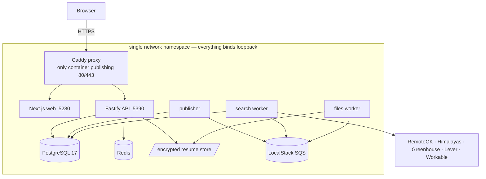
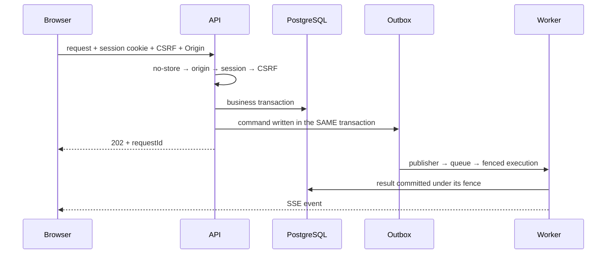

# Architecture

Current V2 architecture as deployed. Detail lives in
[docs/ARCHITECTURE.md](../docs/ARCHITECTURE.md) (V1) and
[v2/ARCHITECTURE.md](../v2/ARCHITECTURE.md) (V2); this is the map an agent needs
before touching anything.

## Topology

Every service except the proxy uses `network_mode: service:proxy`. Postgres,
Redis, LocalStack and the API therefore have **no routable address** — not
merely a firewalled one. The cost is that restarting the proxy alone strands
everything else; see `docs/KNOWN-LIMITATIONS.md`.

## Request flow

The correlation chain is `requestId → runId → executionId → attempt → fence`.
`requestId` is carried into async work as the command's `correlationId`; there
is no separate `traceId` because every trace here starts at an HTTP request.

## Boundaries

| Boundary            | Enforced by                                      |
| ------------------- | ------------------------------------------------ |
| Browser → API       | CSRF token + exact `Origin`; `trustProxy: false` |
| Session → data      | `ownerId` from session + composite foreign keys  |
| API → worker        | outbox command, fence, lease                     |
| Worker → storage    | single-writer; capacity reserved before write    |
| Container → network | loopback binding inside the proxy namespace      |
| Host → internet     | nftables `inet careerscope`; only 22/80/443      |

## Components

- **API** — one `app.ts`; global `onRequest` hook does no-store, origin, session
  and CSRF in that order. Stable error codes on every response.
- **Publisher** — drains the outbox onto the queues.
- **Search worker** — five sources, per-source deadlines, failure isolation,
  fingerprint dedup, then deterministic matching against a frozen profile
  snapshot.
- **Files worker** — parses resumes in a child process so a malformed document
  cannot take the worker down.
- **Storage** — encrypted private filesystem, immutable versions, `statfs`
  capacity reservation, typed `ResumeStorageLimit` surfaced as 507.

## Data model

`users`, `sessions`, `candidate_profiles`, `search_runs`, `outbox_events`,
`command_executions`, `run_events`, `search_jobs`, `saved_leads`,
`lead_history`, `resume_uploads`, `resume_results`, `job_sightings`.

Migrations are forward-only under `v2/migrations/`. There are no down
migrations — a rollback past a migration needs the plan in
`docs/OPERATIONS/ROLLBACK.md`.

## Keeping this current

If a change alters components, flows or boundaries, update this file and the
diagrams in the same change. A diagram that lies is worse than no diagram.
