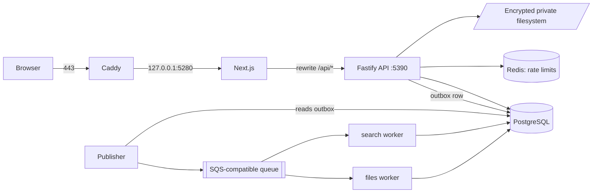

# CareerScope Architecture

## Purpose

CareerScope is a modular monolith, not a microservice system. Most damage done to
it comes from engineers who assume otherwise and split something that was
deliberately kept together, or who wire a tier directly to a store it does not
own. This skill exists to make the boundaries explicit before code moves.

## When to use

- Adding a package, service or worker
- Moving code between the root workspace and `v2/`
- Introducing a runtime dependency
- Changing how the web tier reaches the API, or the API reaches storage
- Any change that touches `container.ts`, `app.ts`, compose files or `tsconfig` references

## Two workspaces, one repository

|             | Root workspace | `v2/` workspace                    |
| ----------- | -------------- | ---------------------------------- |
| Package     | `job-radar`    | `careerscope-v2`                   |
| Store       | SQLite         | PostgreSQL 17 + Drizzle            |
| API         | Fastify        | Fastify                            |
| UI          | React + Vite   | React 19 + Next.js 16              |
| Test runner | Vitest         | `node:test`                        |
| Deployed    | no             | yes, at `https://careerscope.tech` |

They are **not** duplicates to be merged. V1 owns the mature application and
Pages pipeline; V2 owns the deployed workspace. Shared domain logic lives in
root `packages/*` and is consumed by both — `v2/packages/core/src/profile.ts`
imports candidate schemas from `packages/shared/dist`. Do not fork a shared
schema into `v2/` to avoid a build step.

Lead statuses differ on purpose: V1 has six workflow states, V2 has exactly
`['saved', 'archived']`. Resume size limits differ on purpose: V1 10 MiB, V2
5 MiB. Neither is a bug; do not "harmonise" them.

## Request path in the deployed stack



Only the proxy publishes ports. Every other service joins the proxy network
namespace and binds loopback. The browser never talks to the API directly; it
uses a same-origin `/api` path that Next.js rewrites. This is why
`v2/apps/web/src/lib/api.ts` uses relative URLs and `credentials: 'same-origin'`.

## Constraints that must not be broken

- **The API is the only writer to resume object storage.** Workers mount it
  read-only. There is no cross-process reservation; the single-writer contract is
  what makes the capacity accounting sound.
- **PostgreSQL is the source of truth.** The queue is a delivery hint. Never move
  authoritative state into Redis or the queue.
- **AI inference is off.** It must not gain authority over deterministic matching
  and must never receive private candidate data or application-submission rights.
- **Auto-apply is on hold.** Nothing may submit an application without explicit
  per-step human approval.
- **Infrastructure endpoints stay loopback.** `configuration()` in
  `v2/packages/core/src/runtime.ts` enforces this for the database, Redis and the
  queue. `APP_ORIGIN` is the single exception and must be HTTPS when it is not
  loopback.

## Forbidden shortcuts

- Adding a second writer to `/private/objects`
- Giving a worker a direct HTTP route instead of a queued command
- Bypassing the outbox by publishing to the queue inside a request handler
- Reaching into another workspace's `dist/` instead of its package entry point
- Adding a dependency that duplicates something already in `packages/shared`

## Verification

Architecture changes must survive both workspaces:

```sh
npm run typecheck && npm run lint && npm test && npm run build
npm --prefix v2 run typecheck && npm --prefix v2 test && npm --prefix v2 run build
```

## Related documentation

`v2/ARCHITECTURE.md`, `v2/README.md`, `docs/ARCHITECTURE.md`,
`.github/copilot-instructions.md`.
