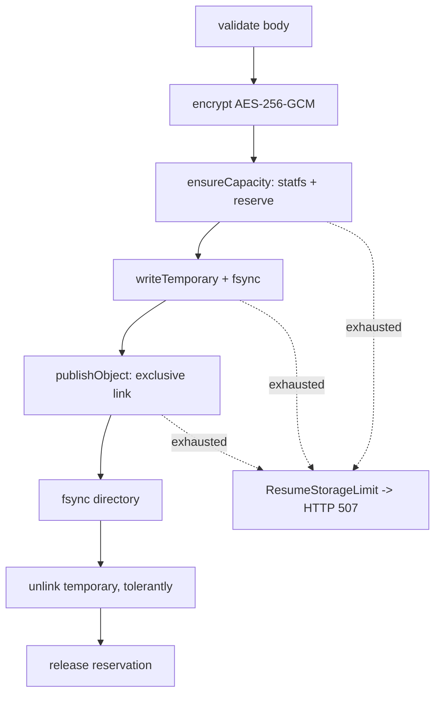

# CareerScope Resume Storage

## Purpose

Resumes are the most sensitive data in the product and the storage path is the
most subtle code in the repository. It survives a `SIGKILL` at any point without
leaking a partially published object, stranding a temporary file, or leaking a
capacity reservation. Every rule below exists because a specific failure was
found and fixed.

## When to use

- Touching `v2/packages/core/src/file-storage.ts`
- Changing the upload or cancel routes in `v2/apps/api/src/app.ts`
- Changing the files worker or anything that reads `/private`
- Investigating 500s that should have been 507s, or stranded files

## Where the code lives

| Concern                     | Path                                        |
| --------------------------- | ------------------------------------------- |
| Storage implementation      | `v2/packages/core/src/file-storage.ts`      |
| Shared contracts            | `v2/packages/core/src/storage.ts`           |
| Upload coordination         | `v2/packages/core/src/resumes.ts`           |
| API routes                  | `v2/apps/api/src/app.ts`                    |
| Tests                       | `v2/packages/core/src/file-storage.test.ts` |
| Physical exhaustion harness | `infra/v3/check-full-disk.mjs`              |

## The write path, in order



The reservation is released in a `finally`. The temporary is unlinked in an
inner `finally`. Exhaustion is mapped to `ResumeStorageLimit` in the outer
`catch`. Removing any one of those three turns a full disk into a permanent
leak or an opaque 500.

## Invariants

- **Publication is an exclusive link.** Objects are immutable; a second
  publication of the same key must not overwrite.
- **Reservations never underflow and are always released**, including on the
  error path. `reservedBytes` must return to 0 after a failed upload.
- **`ENOSPC`, `EDQUOT` and `EFBIG` are typed**, surfaced as `ResumeStorageLimit`
  and mapped to HTTP 507. A raw filesystem error reaching the client as a 500 is
  a defect — this was a real bug in `cancelUpload`.
- **No partial publication and no stranded temporary** after a crash.
- **The API process is the only writer.** Workers mount `/private` read-only.

## Cancellation markers

A cancellation marker is authoritative: it fences a late publication from a
writer that was killed mid-flight and came back.

- Markers are **never age-deleted**. Deleting one reopens the race it exists to
  close.
- Markers count toward capacity accounting and toward `markerLimit`
  (default 10 000). Exceeding it raises `ResumeStorageLimit`, not a generic error.
- `publishCancellation()` returns `true` only when a marker is newly installed.
- On an exhausted volume, cancellation may legitimately fail with
  `ResumeStorageLimit`; the upload stays `uploading` and the cancel is
  retryable once space returns. Do **not** implement "cancellation always wins"
  and do not reserve dedicated metadata headroom without a demonstrated need.

## Reclamation: ownership must be provable

Two distinct paths, and conflating them causes leaks:

- `reclaimTemporariesAtStartup()` runs once at boot with `linked: true`. After a
  successful exclusive link the temporary is a second name for a live object
  (`nlink > 1`), so a reclaimer that skips `nlink > 1` would strand it forever.
  This was a real leak.
- `sweepAbandonedTemporaries()` is maintenance only and requires `nlink === 1`,
  because during normal operation it cannot prove the file is not a live alias.

## Cross-process reservation is unsupported

Capacity accounting is per-process and correct only because the API is the sole
writer on a single host. Do not claim distributed capacity coordination. Running
multiple writers or a shared volume would require PostgreSQL-backed
coordination, which does not exist.

## Forbidden shortcuts

- Catching an exhaustion error and returning a generic 500
- Age-deleting cancellation markers
- Reclaiming temporaries without proving ownership
- Overwriting a published object
- Adding a second writer
- Weakening encryption or reusing a nonce

## Failure modes to test

Crash before publication; crash between link and unlink; crash while holding a
lease; disk full during reserve, during write and during publish; cancellation
racing publication; cancellation on a full volume; marker quota exceeded; a
foreign marker for another owner's key.

## Verification

```sh
npm --prefix v2 test                     # includes file-storage.test.ts
npm run test:full-disk                   # real 2 MB tmpfs, reserveBytes=0
npm --prefix v2 run test:crash-recovery  # four real SIGKILL phases
```

The full-disk harness asserts `exhaustionError=ResumeStorageLimit`,
`strandedTemporaries=0`, `reservedBytesAfterFailure=0` and that cancellation
fails typed then succeeds after space is released. Do not replace it with a
mock.
