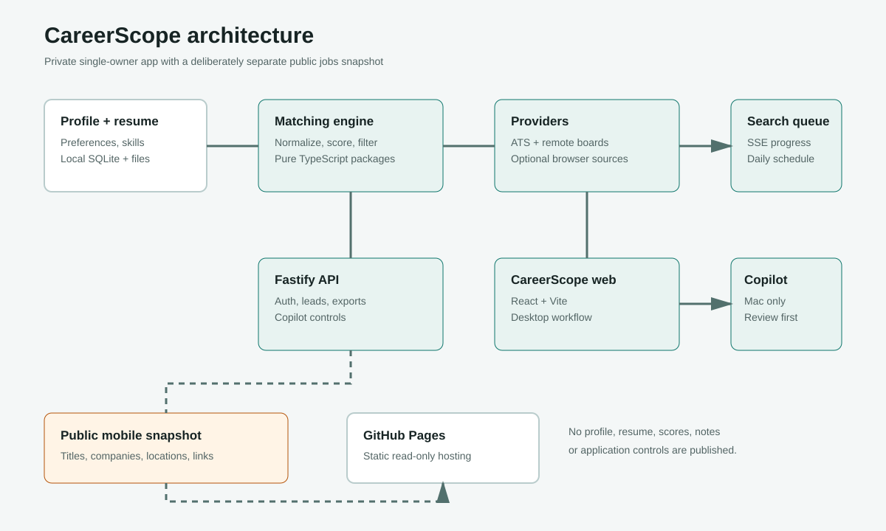
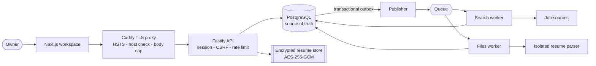
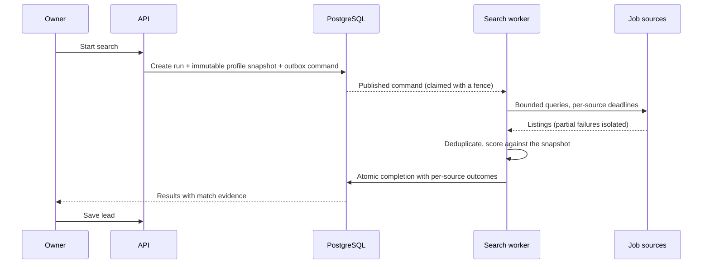
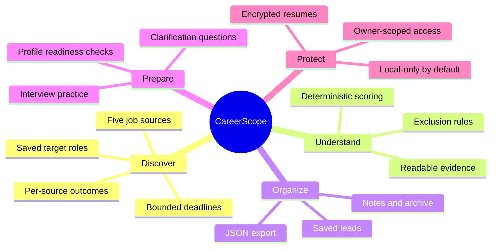

# CareerScope

A private, single-owner job-search workspace, formerly Job Radar.
The product release version is defined in [package.json](package.json) and displayed
in the app and mobile-site footers. See [versioned publishing](docs/ENCRYPTED-ADMIN.md#change-the-passphrase-and-publish)
for patch, minor and major releases.
See [release verification](docs/RELEASE-REVIEW.md) for the verification scope.

## Versions And Readiness

The root application is the preserved **v1.3.4** runtime. The separate
[V2 migration](v2/README.md) is **2.0.0-alpha.1**, not a finished replacement or
production release. Its [architecture and acceptance gaps](v2/ARCHITECTURE.md)
are authoritative for V2; the root stack below describes V1 only.

V2 currently supports authenticated accounts, encrypted resume upload with isolated
parsing and explicit profile review, five-source discovery, deterministic matching,
saved leads, rules-based interview preparation, cancellation and JSON export.
AI inference stays off by design, and full provider parity, account recovery email and
cutover remain incomplete. The planned MinIO runtime is blocked by upstream
maintenance/distribution changes; synthetic S3 tests do not establish MinIO readiness.

**Public jobs:** <https://varunjakkampudi-tech.github.io/careerscope/>

CareerScope runs job collection, resume matching, profile storage and optional
Copilot application preparation locally on your Mac. GitHub Pages serves a
separate mobile-friendly snapshot for browsing results and applying manually.

- **Public view:** sanitized posting metadata and employer links, with search,
  source filtering and shared System / Light / Dark themes.
- **Admin snapshot:** a passphrase-encrypted, read-only export of your leads,
  match scores and statuses. Decryption happens in your browser; this is not a
  server account login or a live connection to your Mac.
- **Private workspace:** resumes, contact details, notes, credentials and browser
  state remain local and are excluded from both snapshot exports.

Each admin release requires a locally generated encrypted export. See
[encrypted admin setup](docs/ENCRYPTED-ADMIN.md),
[release verification and remaining gates](docs/PAGES-RELEASE-REVIEW.md), and
[the architecture guide](docs/ARCHITECTURE.md).



## How It Fits Together



The API is the only process that writes resume objects. Workers read. Every unit of
durable work is claimed with a fence, so a crashed worker cannot settle a run twice.

## Discovery To Lead



Matching uses the profile snapshot taken when the search started, so results stay
explainable even after the profile changes.

## Capabilities



Upload a resume, say what you want, and get job leads that actually match it —
scored, explained, and complete enough to act on.

Each lead can carry the company, role, package, location, full job description,
detected tech stack, the direct apply link, the company's careers portal and
website, and — when one can be **verified** — a careers email. Everything is
scored against your resume with a breakdown you can read, so an "87%" is
auditable rather than a number the app asserts. Availability depends on the source;
missing salaries and snippet-only descriptions are not invented or treated as complete.

---

## What it does

1. **Parse a resume.** PDF or DOCX in, skills / titles / years of experience out,
   all of it editable before you use it.
2. **Take your terms.** Current and expected CTC, notice period, target titles,
   preferred locations, remote-only, minimum salary, employment types, companies
   and keywords to exclude. New searches start at **85%**; the Leads view defaults
   to **0%** so all collected leads can be reviewed.
3. **Search 12 job sources at once**, streaming progress and leads as they land.
4. **Score every job** against your resume across seven weighted dimensions and
   keep what clears your threshold.
5. **Show them**, filterable and sortable, with a detail view holding the full
   JD, matched-versus-missing skill chips, the score breakdown, and every link.
6. **Export** to XLSX or CSV when you want to work through them elsewhere.

The profile editor also imports JSON, merging extra details such as CTC, notice
period, and locations without replacing the attached resume. **Gmail job alerts**
are an optional read-only source, and searches can run automatically while the
API is running. See [Gmail and automatic search setup](docs/GMAIL.md).

### Profile JSON

Upload your resume, then import a JSON file in the profile editor and save the
merged profile. A partial file can contain just your additional details:

```json
{
  "preferences": {
    "locations": ["Bengaluru", "Hyderabad"],
    "remoteOnly": false
  },
  "application": {
    "currentCtc": "20 LPA",
    "expectedCtc": "30 LPA",
    "noticePeriodDays": 30,
    "willingToRelocate": true,
    "yearsOfExperience": 5
  }
}
```

Full files can also include `candidate` and `preferences.titles` /
`preferences.techStack`. Omitted fields keep their current values; supplied
arrays replace the existing array. Imported resume IDs are ignored because an
ID from another installation does not identify a local upload.

An opt-in local **Apply with Copilot** workflow prepares applications in a separate
browser and displays progress, questions and explicit submission approval in the app.
See [Application agent setup and limits](docs/APPLICATIONS.md).

---

## Quickstart

Requires **Node 24 or newer** (`node:sqlite` is only stable from 24.0 — see
[Why Node 24](#why-node-24)).

```bash
npm install
cp .env.example .env          # then edit it — see Configuration
npm run build                 # compile workspace dependencies for API and CLI commands
npm run db:migrate
npm run seed:companies        # optional: 112 pre-verified employers
npm run dev                   # API on :8080, web on :5173
```

Open <http://localhost:5173/login> and create the owner account on the local machine.
Subsequent visits require sign-in. Browser sessions use revocable HttpOnly JWT
cookies, not browser-stored tokens. See [Login and deployment](docs/AUTHENTICATION.md).

For mobile snapshots, follow [Publish Mobile Results](#publish-mobile-results).
Use a local HTTP preview, not a `file://` URL: the pages fetch their JSON assets.
The full private app still requires its API and database; Pages cannot run them.

**Out of the box, with no API keys at all**, nine of the twelve sources work:
the six ATS boards and the three remote boards are keyless. The three
aggregators tell you which variable they need instead of failing silently.

---

## Configuration

Everything is read from the environment and validated by Zod at boot, so a bad
value fails immediately with the variable's name rather than at 3am with a
stack trace. `.env.example` is the annotated reference; this is the summary.

| Variable                           | Default                 | Notes                                                                                        |
| ---------------------------------- | ----------------------- | -------------------------------------------------------------------------------------------- |
| `PORT` / `HOST`                    | `8080` / `0.0.0.0`      |                                                                                              |
| `DATA_DIR`                         | `./data`                | SQLite database, uploaded resumes, exports                                                   |
| `APP_API_KEY`                      | —                       | Required in production. Minimum 24 characters; generate with the one-liner in `.env.example` |
| `AUTH_DISABLED`                    | `false`                 | Refused outright when `NODE_ENV=production`                                                  |
| `CORS_ORIGINS`                     | empty                   | Empty means same-origin only. Set this to the Pages origin for the split deploy              |
| `SERVE_WEB` / `WEB_DIST`           | `false` / `../web/dist` | Makes the API serve the SPA — the single-origin EC2 setup                                    |
| `ENABLE_SCRAPERS`                  | `false`                 | Browser-backed LinkedIn / Naukri / Indeed ([what that means](#the-three-big-boards))         |
| `ENABLE_LLM_RERANK`                | `false`                 | Needs `ANTHROPIC_API_KEY`                                                                    |
| `ADZUNA_APP_ID` / `ADZUNA_APP_KEY` | —                       | Free tier at developer.adzuna.com                                                            |
| `JOOBLE_API_KEY`                   | —                       | Free at jooble.org/api/about                                                                 |
| `RAPIDAPI_KEY`                     | —                       | Enables JSearch, which aggregates LinkedIn / Indeed / Glassdoor                              |
| `SEARCH_CONCURRENCY`               | `4`                     | Providers queried in parallel                                                                |
| `RUN_TIMEOUT_MS`                   | `900000`                | 15 minutes                                                                                   |

**Keys are never echoed.** `GET /api/sources` reports _which variable_ is
missing, never a value; the log redacts credential paths; and the settings
screen shows `set` / `unset` and nothing more.

---

## Publish Mobile Results

After local setup and job collection:

```sh
npm run mobile:export       # sanitized public job metadata
npm run mobile:admin        # encrypted private matching snapshot
npm run pages:preview       # http://127.0.0.1:5176/
```

`mobile:admin` prompts for a hidden passphrase, or reads
`ADMIN_SNAPSHOT_PASSPHRASE` from the ignored root `.env`. Use a strong, unique
passphrase of at least 16 characters, preferably generated by a password manager.
Never use a `VITE_` variable for it, commit it, or put it in GitHub Actions secrets.
Known dummy placeholders are rejected. The local owner login password is separate.

Open `/admin.html` in the preview and verify that your passphrase unlocks your
leads. Only ciphertext is written to `mobile-site/admin.enc.json`; no plaintext
admin JSON is created. Public files exclude scores/statuses; the encrypted
snapshot includes them but excludes resume files, personal contact details,
notes and credentials. Only minimal matching-profile metadata is included.

Before publishing:

```sh
npm run pages:test          # encryption, export privacy, theme and staging guards
npm run pages:stage         # requires admin.enc.json and a new/absent _site directory
```

Commit only reviewed source/docs and the public/encrypted snapshot files, then
push to `main`. In GitHub Settings > Pages, select **GitHub Actions**. The
workflow validates the exports and stages an explicit file allowlist. A missing
or malformed encrypted export stops the deployment rather than silently
publishing a broken admin view. Never include `.env`, databases, resumes,
browser state, or local test artifacts in the commit or Pages artifact.

After a successful deployment, **Admin login** on the public page opens
`https://varunjakkampudi-tech.github.io/careerscope/admin.html`. Verify unlocking
on your phone before considering the release complete.

Both views work while the Mac is off, using the last published snapshot. New
results require another local export and push. `mobile:watch` only refreshes
the public JSON locally; it does not publish or refresh the encrypted snapshot.
Manual mobile applications do not automatically update the Mac's lead statuses.

**Privacy:** public jobs are downloadable by anyone. The encrypted snapshot is
also publicly downloadable, so weak passphrases are vulnerable to offline
guessing. Old copies cannot be revoked by changing the next export's passphrase.
Only theme preference is persisted in browser storage; decrypted leads stay in
page memory and are cleared on lock. See the
[security boundaries](docs/ENCRYPTED-ADMIN.md#security-boundaries).

### Verification

The reviewed local build passed 956 repository tests, 7 static security/theme
checks, typecheck and production build. Lint had zero errors and three existing
warnings. A synthetic-data visual suite matched 120 screenshots across Chromium,
Firefox and WebKit, light/dark themes, and 320-1920px widths.

```sh
npm run pages:visual:update # create/review initial local baselines
npm run pages:visual        # compare against those baselines; do not auto-update
```

These commands use already-installed Playwright browsers. Baselines and reports
live under ignored `test-results/`. They are initial local baselines, not a
guarantee of accessibility conformance or production readiness. WebKit tooling
limitations, physical-device checks and real-export/deployment gates are recorded
in the [release review](docs/PAGES-RELEASE-REVIEW.md).

---

## Job sources

|                   | Sources                                                        | Key needed             |
| ----------------- | -------------------------------------------------------------- | ---------------------- |
| **ATS boards**    | Greenhouse, Lever, Ashby, Workable, SmartRecruiters, Recruitee | No                     |
| **Remote boards** | Remotive, RemoteOK, Himalayas                                  | No                     |
| **Aggregators**   | Adzuna, Jooble, JSearch                                        | Yes, all free tiers    |
| **Browser**       | LinkedIn, Naukri, Indeed                                       | No — opt-in            |
| **Email**         | Gmail alerts from LinkedIn, Naukri, Indeed                     | Read-only Google OAuth |

The ATS boards are the highest-quality leads: they return the **full JD** and a
**direct apply link**, because they _are_ the employer's application system.

### The three big boards

LinkedIn, Naukri and Indeed have no public API, so they are reached two ways and
you can use either or both.

**Through JSearch** (`RAPIDAPI_KEY`), which aggregates LinkedIn, Indeed and
Glassdoor under agreement and names the original publisher — a lead reads
`JSearch · via LinkedIn` and links back.

**Directly, with a browser** (`ENABLE_SCRAPERS=true`), which opens the same
public search pages a person would, logged out. What that tier does and does not
do is worth stating plainly, because "scraper" covers a wide range:

- **No disguise.** No stealth plugin, no fingerprint patching, no client-hint
  forgery, no captcha solving, no signed-token reimplementation, no signed-in
  session. Chromium runs _headed_ — not as a trick, but because Naukri's edge
  refuses a headless one and headed is the literal thing it checks for. On a
  server that means an X server; the `api-scrape` image supplies one.
- **`robots.txt` is obeyed.** Indeed disallows `/viewjob`, so its job detail
  pages are never fetched. Indeed leads therefore carry only the search snippet
  plus Indeed's own structured skill tags, stay marked low-confidence, and are
  **capped at 80%** — which is below the default 85% threshold, so Indeed
  contributes nothing until you move the slider. That is the honest cost of not
  reading a page we were asked not to read.
- **A wall is reported as a wall.** Rate limits, login walls, captchas and
  Cloudflare interstitials each get named in the run log. A blocked source never
  returns "0 postings matched", because that reads as a quiet market and sends
  you looking in the wrong place.

Remotive and RemoteOK both require attribution, so the source is always shown on
the lead and always links back. Remotive's public feed is also delayed roughly
24 hours; that is their API, not a bug here.

### Verified, never guessed

Company enrichment writes `"Not yet verified"` rather than inventing a value:

- **Careers URL** — from the ATS payload, or a confirmed 200 on `/careers`,
  `/jobs`, `/about/careers`.
- **Portal URL** — detected from ATS signatures in the careers page HTML.
  Six platforms are recognised without having a provider for them (Workday,
  iCIMS, Zoho Recruit, Keka, Freshteam, Darwinbox); those get a portal link and
  nothing more.
- **Careers email** — **only** from a real `mailto:` on a fetched careers or
  contact page, and only when the local part is one of
  `careers · jobs · hr · recruitment · talent · hiring · apply`. Never
  constructed from the domain. When there isn't one, the UI says
  "apply via portal", because a plausible-looking wrong address costs you an
  application.

---

## How the matching works

The threshold requirement is the whole point, so this is worth stating plainly.

Every job is scored 0–1 across seven dimensions, combined by weight:

| Dimension    | Weight | Basis                                                              |
| ------------ | ------ | ------------------------------------------------------------------ |
| Skills       | 0.40   | IDF-weighted coverage of the skills **the JD demands**             |
| Title        | 0.15   | Token overlap with your target titles, plus a role-family bonus    |
| Seniority    | 0.12   | Distance on the ladder; capped hard at a gap of two or more        |
| Experience   | 0.10   | Inside the JD's year range, tapering outside; neutral if unstated  |
| Location     | 0.10   | Exact city · same metro · remote · willing to relocate             |
| Compensation | 0.08   | Against your expected CTC; **neutral, not zero, when undisclosed** |
| Recency      | 0.05   | Full marks inside a week, decaying to the search window edge       |

Two decisions carry most of the accuracy:

**Skills are scored against what the JD asks for, not against everything you
know.** The obvious implementation — matched skills ÷ your whole tech stack —
punishes you for being broad: 20 skills on your resume and a JD naming 5 of them
scores 25%, however perfect the fit. The original code in this repository did
exactly that, which is why its 85% threshold returned nothing at all. Required
and preferred sections are weighted 1.0 and 0.5, matched through an alias table
(React ↔ React.js, Node ↔ Express, MySQL ↔ SQL), and weighted by inverse
document frequency so FastAPI counts for more than JavaScript.

**A job whose full JD could not be read is capped at 80%.** So crossing 85%
always means the description was actually fetched and parsed. Thin snippets
cannot fake a strong match — which also means Jooble, which only ever returns a
snippet, tops out at 80% by construction.

Hard gates exclude a job outright: an excluded keyword, an employment-type
mismatch, or `remoteOnly` against an on-site role. A company on your
do-not-apply list is shown but flagged, never hidden.

With `ENABLE_LLM_RERANK=true` and an `ANTHROPIC_API_KEY`, the top 40 heuristic
matches go to Claude for a semantic score and a one-line rationale; the final
score is `0.6 × heuristic + 0.4 × LLM`. The app is fully functional without it.

---

## Deployment

Two shapes, both supported, and they differ in two build-time variables.

### GitHub Pages (SPA) + EC2 (API)

The SPA is static and can live on Pages; the API cannot — Pages has no Node, no
filesystem and no way to accept a file upload.

- `.github/workflows/deploy-pages.yml` builds `apps/web` with
  `VITE_BASE_PATH=/<repo>/` and `VITE_API_BASE_URL` from the repository variable
  `API_BASE_URL`, copies `index.html` to `404.html` so deep links survive a hard
  refresh, and publishes. It **fails the build** if `API_BASE_URL` is unset,
  rather than shipping a site whose every request resolves to github.io.
- The API host must then set `CORS_ORIGINS` to the Pages origin.

### EC2 alone (single origin)

The API serves the SPA itself, so there is no CORS and one hostname.

```bash
# on the box, once
git clone <repo> /opt/job-radar && cd /opt/job-radar
cp .env.example .env && $EDITOR .env    # APP_API_KEY, provider keys
docker compose -f infra/docker-compose.yml up -d --build
```

`infra/` holds the pieces: a multi-stage `Dockerfile`, `docker-compose.yml`
(API + nginx + certbot behind a profile), three nginx configs, and
`job-radar.service` for running under systemd instead of Docker.
This is the V1 self-hosted path; the deployed V2 stack uses `infra/v3` instead.

nginx proxies but does **not** serve the SPA — the API does, so client-side
route fallback lives in exactly one place. `proxy_buffering` is off on
`/api/runs/*/events`, or search progress arrives in one lump at the moment it
stops being useful.

Step-by-step, including TLS and the ownership trap on the data volume:
**[docs/RUNBOOK.md](docs/RUNBOOK.md)**.

---

## Project layout

npm workspaces, TypeScript project references, one build graph.

```
packages/
  shared/       Zod schemas + inferred types — one source of truth for API and UI
  resume/       PDF/DOCX → text → derived profile
  matching/     the scoring engine + optional LLM rerank
  providers/    job sources behind one interface, including Gmail alerts,
                plus HTTP retry/cache/rate-limit
                and a Playwright tier for the three boards that have no API
apps/
  api/          Fastify, SQLite, queue, SSE, company enrichment, exports, MCP bridge
  web/          React 19 + Vite + Tailwind v4 + TanStack Query
infra/          Dockerfile, compose, nginx, systemd
mobile-site/    public static site and encrypted read-only admin for GitHub Pages
scripts/        snapshot exporters, publishing tools, and browser verification
seed/           versioned source data — 112 employers, 117 postings, hand-verified
data/           runtime only: the SQLite database, uploaded resumes. Gitignored
docs/           architecture, operations, and Gmail setup
```

Tests stay next to their owning modules (`score.ts` and `score.test.ts`), with
shared test builders in `*.fixtures.ts`. VS Code nests those related files so
the source tree stays readable without splitting a feature across directories.
Tests and test helpers are excluded from production output.

`dist/`, `dist-types/`, and `*.tsbuildinfo` are generated, not source. Stop the
development server before `npm run clean`; it removes these outputs from every
workspace without touching resumes, profile data, or dependencies. `npm test`
runs directly against workspace source and works immediately after cleanup.
`npm run dev` rebuilds its dependencies before starting the servers.

Dependencies run one way: `shared ← matching ← providers ← api`, and
`shared ← web`.

Why it is built this way — the module graph, the run pipeline, the invariants,
and how to add a source or a scoring dimension:
**[docs/ARCHITECTURE.md](docs/ARCHITECTURE.md)**.

The [release review](docs/RELEASE-REVIEW.md) records the September 2026 cleanup,
test coverage and deployment limits.

### API

```
GET    /api/health · /api/health/ready          public — for load balancer probes
GET    /api/sources                             what is enabled, and what each needs
GET    /api/profile · POST · PUT · DELETE
GET    /api/profile/status
POST   /api/resume                              multipart → { resumeId, derived }
GET    /api/resume · /api/resume/:id · /:id/file · DELETE
POST   /api/search                              → { run, events }
GET    /api/runs · /runs/active · /runs/:id · /runs/:id/logs
POST   /api/runs/:id/cancel
GET    /api/runs/:id/events                     SSE: progress · log · lead · done · error
GET    /api/leads · /leads/counts · /leads/skill-gap · /leads/:id
PATCH  /api/leads/:id · POST /api/leads/bulk · DELETE /api/leads/:id
GET    /api/companies · /api/companies/:id
GET    /api/export/leads.xlsx · .csv
```

Everything under `/api` needs `x-api-key` (or `Authorization: Bearer`) except
the two health routes. Everything _outside_ `/api` — the SPA shell and its
assets — is public, because on the single-origin deploy this server has to hand
you the screen where you enter the key.

The API key is never accepted in a query string, SSE included, since a URL lands
in proxy logs, browser history and `Referer` headers. The web client therefore
consumes the event stream with `fetch` and a streaming reader rather than
`EventSource`, which cannot set headers.

### MCP

The same services are exposed to VS Code Copilot as 11 tools over stdio:

```bash
npm run build && npm run mcp
```

`get_profile`, `set_profile`, `parse_resume`, `list_sources`, `search_jobs`,
`run_status`, `cancel_run`, `list_leads`, `get_lead`, `update_lead`,
`export_leads`. Thin wrappers over the same code the HTTP routes call, so the
editor and the browser share one brain.

---

## Scripts

|                           |                                                                             |
| ------------------------- | --------------------------------------------------------------------------- |
| `npm run dev`             | API and web together, with the dev proxy                                    |
| `npm run build`           | every workspace, in dependency order                                        |
| `npm test`                | Vitest against source, in two projects: `node` and `web` (jsdom)            |
| `npm run clean`           | remove generated workspace output; preserve runtime data and dependencies   |
| `npm run typecheck`       | `tsc --build`, then two passes over the test files the build graph excludes |
| `npm run lint` / `format` | ESLint / Prettier                                                           |
| `npm run db:migrate`      | idempotent; safe to run on every boot                                       |
| `npm run seed:companies`  | 112 pre-verified employers. Takes an optional path argument                 |
| `npm start`               | the built API                                                               |
| `npm run mcp`             | the MCP server over stdio                                                   |

CI runs formatting, lint, typechecking, tests, and builds on every pull request,
then boots the built server and health-checks it. Docker/browser-image checks run
on manual CI runs or when repository variable `ENABLE_CONTAINER_CI=true`.

Cloud deployment workflows remain available but do not deploy automatically by
default. Set `ENABLE_PAGES_DEPLOY=true` in GitHub
repository variables only for the hosting you use, after configuring its
credentials. Both workflows can also be launched manually. Local development
needs none of these variables or GitHub Actions.

`vite build` is
in CI deliberately: a Rollup manual-chunk name is a plain string invisible to the
TypeScript project graph, and a stale one has already broken a build here after
both `tsc` and ESLint passed clean.

---

## Deliberate omissions

**No unattended submission.** The local Copilot application worker requires a
human to approve page actions and final submission. It is not available in
production/server mode, does not solve CAPTCHA, and does not accept passwords
or verification codes through its UI. Unsupported portals remain manual.

**No scrapers for Foundit and Cutshort.** `SCRAPE_SOURCES` in
`packages/shared/src/constants.ts` lists five identifiers; only three —
LinkedIn, Naukri, Indeed — have a provider. The other two exist so the leads
seeded from the old spreadsheet keep their real provenance instead of being
relabelled. A test asserts the gap, so it stays visible rather than becoming a
source that silently returns nothing.

**Single owner.** One owner account protects this installation's existing profile,
resume and leads. There is no public registration or multi-user data isolation.
API keys remain supported for trusted automation clients.

---

## Known issues

- `npm audit` reports **two moderate advisories**, both from `exceljs → uuid`.
  Accepted: `exceljs` has no fixed release, the path is only reached when _you_
  click export, and the input is your own leads.
- The container image and the nginx configuration have never been built on a
  developer machine here — Docker was not available. CI's `image` job is what
  exercises them; treat the first `docker compose up` as the real test.

### Why Node 24

`node:sqlite` is a built-in, which is why there is no `better-sqlite3`, no
native build step and no compiler on the deploy host. It was added flagged in
22.5, unflagged in 23.4, and only **stable in 24.0** — so `engines.node` pins
`>=24.0.0`, CI runs 24, and the image is `node:24-slim`. Anything older is a
different database layer.

---

## License

Private.
