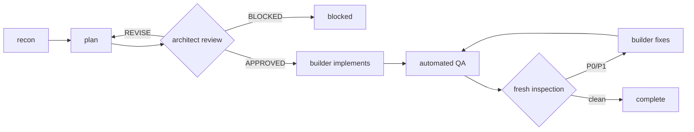

# AI engineering workflow

How CareerScope work gets planned, built and reviewed by three agents, and why
it is shaped this way.

The rule everything else serves: **the agent that implements a change is never
the sole authority that it is correct.**

## The three roles

| Role                 | Agent                      | Writes code?             | Model                      |
| -------------------- | -------------------------- | ------------------------ | -------------------------- |
| Orchestrator         | `CareerScope Orchestrator` | coordinates, owns `.ai/` | current Copilot session    |
| Architect / Reviewer | `CareerScope Architect`    | **no — no edit tool**    | a Claude model             |
| Builder              | `CareerScope Builder`      | yes                      | **not pinned — see below** |

Read-only for the Architect is not a promise in a prompt. The agent is granted
`search` and `read` and is not granted `edit`, so it cannot modify
implementation files even if instructed to. That is the one capability VS Code
lets us actually enforce.

### The builder model is unresolved

GPT-6 Astra was requested. It is **not available** in this installation:

```
$ copilot --model gpt-6-astra -p "..."
Error: Model "gpt-6-astra" from --model flag is not available.
```

No substitute has been written into the agent file, because silently swapping
the model is precisely what this workflow forbids. Pick the builder model in the
VS Code model picker and add a `model:` key with the exact identifier shown
there. Do not guess one.

## The loop



Bounds: **5** plan-review rounds, **3** implementation rounds, **3**
inspections. Hitting a bound sets `status: "blocked"` in
`.ai/LOOP-STATE.json` with the unresolved findings recorded. It never becomes
`complete`.

Each inspection is a **fresh** Architect session. An inspection that remembers
the build conversation is not independent.

## State lives in the repository

Conversation memory does not survive a session, and fresh sessions are the
point. So every handoff reads and writes `.ai/` — eighteen files:

`PROJECT-CONTEXT` · `REQUIREMENTS` · `ARCHITECTURE` · `SYSTEM-DESIGN` ·
`UX-DESIGN` · `DECISIONS` · `ACTIVE-TASK` · `PLAN` · `PLAN-REVIEW` ·
`IMPLEMENTATION-LOG` · `CODE-REVIEW` · `SECURITY-REPORT` ·
`PERFORMANCE-REPORT` · `QA-REPORT` · `FINAL-AUDIT` · `DOCUMENTATION-AUDIT` ·
`CLEANUP-REPORT` · `LOOP-STATE.json`

No secrets in any of them; the validator checks.

Because read-only agents have no edit tool, the **Orchestrator** transcribes
their findings into the reports verbatim.

## Using it

Open Copilot Chat, pick **CareerScope Orchestrator**, and describe the task.
It will run recon, write `ACTIVE-TASK.md` and `PLAN.md`, then hand off with:

```
#CareerScope Architect  Review .ai/PLAN.md against .ai/ACTIVE-TASK.md.
                        Round 1 of 5. Severity-tagged findings + verdict.

#CareerScope Builder    Implement approved .ai/PLAN.md items 1-4.
                        Run the validation block and report real output.
```

Switch the model in the picker when switching roles. The agent file does not
change the picker for you.

## Severity

`P0` blocker · `P1` serious · `P2` important · `P3` minor

P0 and P1 must be fixed. P2 must be fixed when it affects correctness,
maintainability, accessibility, UX, security or architecture. P3 may remain only
if genuinely non-blocking and written down with the reason.

## Done

Requirements and acceptance criteria met; no open P0 or P1; P2s fixed or
justified; typecheck, lint, tests and build pass; accessibility and smoke checks
pass where applicable; docs and architecture current; diff reviewed with no
unrelated changes; final independent inspection passed; `LOOP-STATE.json` says
`complete`.

None of these count as done: a zero exit code, an output file existing, a model
saying "done". On this machine `claude auth status` exits **0** while reporting
`loggedIn: false` — that is the trap, live, in the first command anyone runs.

## Relationship to Claudex Loop

`.github/CLAUDEX-WORKFLOW.md` documents a separate cross-CLI workflow
(`chaseai-yt/claudex-loop`) whose host is a Claude Code or Codex terminal
session. Both exist deliberately and do not overlap:

- **This workflow** — inside VS Code + Copilot, for everyday CareerScope work.
- **Claudex Loop** — cross-CLI, when you want a genuinely different provider
  and account reviewing the plan.

They share the same principle and different machinery. Use one per task, not
both at once.

## Known limitations of the setup

- VS Code cannot restrict which model an agent file gets; the picker governs.
  Role/model pairing is a convention the Orchestrator states in each handoff.
- Agent files cannot force a _fresh_ session. Starting one is manual.
- The Architect's read-only guarantee holds only for tools. It cannot stop a
  human pasting its suggestions in and calling that a review.
