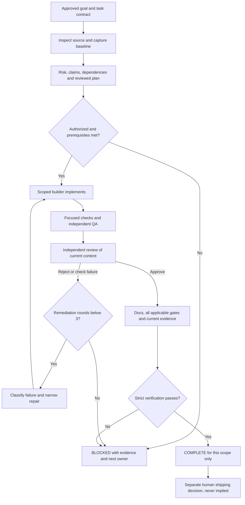

# State Machine

The diagram is **operating policy**, advanced by the operator and Copilot, not
an automatic daemon or a literal JSON state graph. The
[validator](../../scripts/engineering.mjs) retains `NOT_STARTED`, `IN_PROGRESS`,
`BLOCKED`, `VERIFIED`, `COMPLETE` for schema-1 tasks and for objective/gate
statuses. Schema-2 task history is replayed by the
[contract validator](../../scripts/engineering-contract.mjs).

Its success path is CREATED -> READY -> ASSIGNED -> IN_PROGRESS -> IMPLEMENTED
-> VERIFYING -> REVIEW -> PASSED -> COMPLETE. WAITING, BLOCKED, FAILED,
REJECTED, NEEDS_REWORK and ESCALATED have explicit recovery/terminal edges in
source. History must start at CREATED and match the recorded status, with
ordered canonical timestamps, registered actors and findings for failure states.
Do not fabricate history to relabel a legacy record as schema 2; retain schema 1
when history is unavailable and begin a new schema-2 objective/task honestly.

## Transitions And Invalidations

- Start only after authorization, baseline, ready dependencies and exclusive
  claims. `check` validates records; `ready` is eligibility, not authorization.
- A failed check or rejected review prevents completion. Record the failure
  before repair; never rewrite a prior verdict into approval.
- Claimed content and bound contract changes invalidate objective-wide
  evidence/review. Final reporting exceptions are narrowly defined in the
  [evidence model](evidence-model.md); revalidate the integrated content.
- BLOCKED needs a concrete cause, retained attempts, owner and next action.
  Resumption requires the missing prerequisite; reassignment does not reset time
  or attempts. Do not mark COMPLETE to bypass an exhausted loop.
- Schema-1 VERIFIED tasks and schema-2 PASSED tasks still need aggregate
  completion consistency. `verify` requires a COMPLETE objective, COMPLETE
  tasks and VERIFIED/COMPLETE applicable gates with current evidence; baseline
  intentional refusal is not an application test failure.

Schema 2 fixes attemptLimit at 3 and counts retained REMEDIATION failures after
an INITIAL failure at attempt 0. An unresolved third remediation failure requires
task ESCALATED; this is distinct from the objective's BLOCKED status. Smaller
specialist [bounds](orchestration.md#bounds-and-failures) still apply as policy.
R5 requires human approval before assignment and is never automatically ready.
See [risk](risk-model.md) and [evidence](evidence-model.md).
