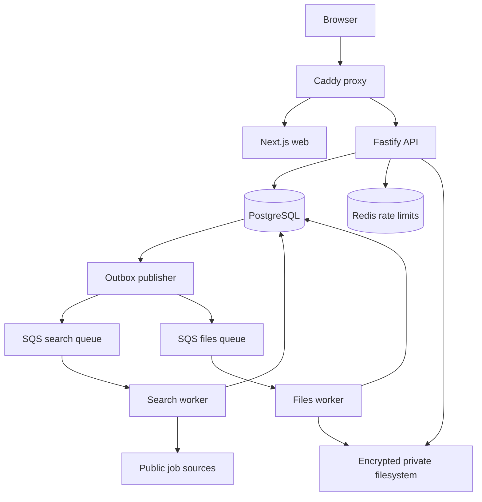
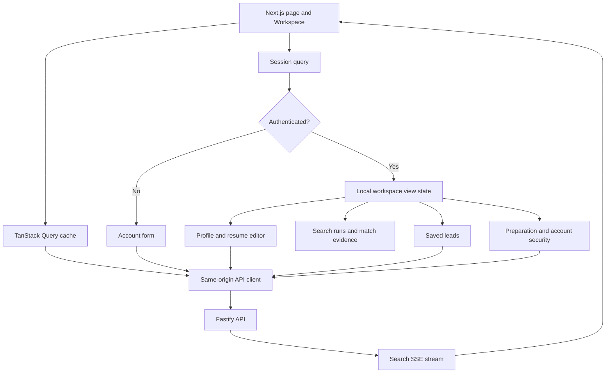
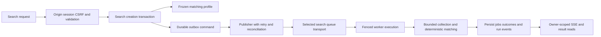
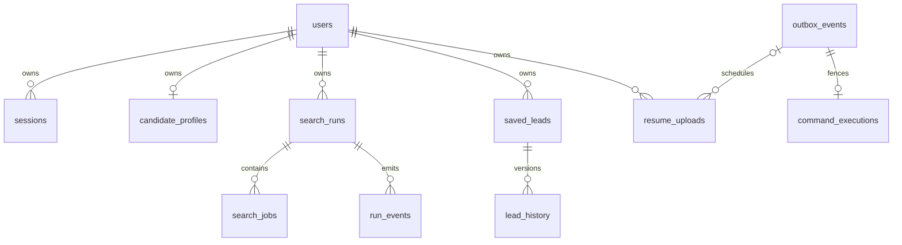
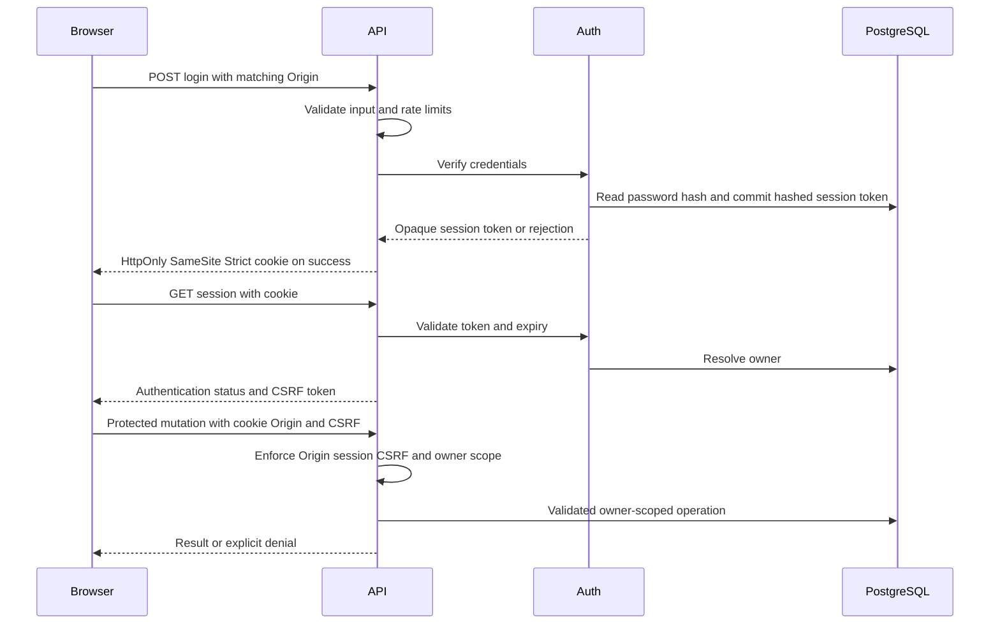
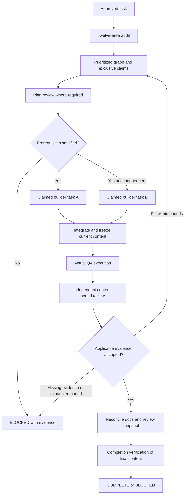
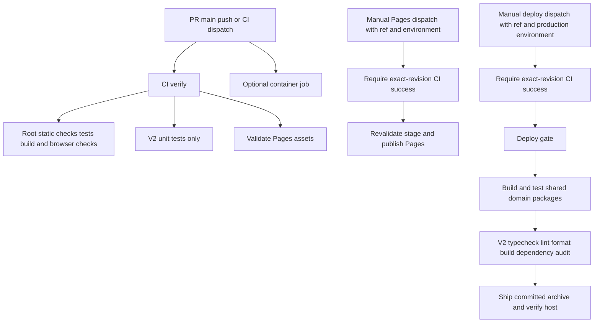
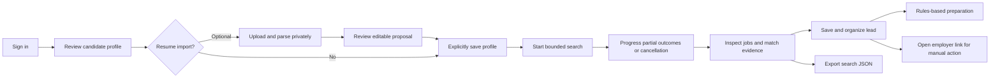

# Architecture Index

Start with [project state](../PROJECT-STATE.md). The root
[V1 architecture](../ARCHITECTURE.md) describes Fastify/SQLite and React/Vite;
[V2 architecture](../../v2/ARCHITECTURE.md) describes the PostgreSQL/Next.js
stack and also contains explicitly historical target sections. V1 domain
packages remain V2 build dependencies. Do not infer deployed revision from the
local tree or treat a target diagram as implementation.

These eight diagrams summarize inspected source, not new components or live
verification. The orchestration diagram is the approved engineering workflow;
the CI diagram describes existing automation, including its gaps. Each diagram
links its owning source so later changes can be reconciled locally.

## System

Sources: [production Compose](../../infra/v3/compose.production.yml),
[implemented V2 topology](../../v2/ARCHITECTURE.md#implemented-topology),
[publisher](../../v2/apps/workers/search/src/publisher.ts).

Only the proxy publishes host ports. Other services share its network namespace;
the proxy must not restart alone. The API writes resume objects; the files
worker mounts the store read-only. BullMQ is an optional search transport, not
the files transport. Bootstrap is a one-shot dependency, omitted from the
steady-state diagram. No inference service is shown because inference is off.

## Frontend

Sources: [V2 page](../../v2/apps/web/src/app/page.tsx),
[API client](../../v2/apps/web/src/lib/api.ts),
[V1 architecture](../ARCHITECTURE.md). This is V2's current local source, not
the older no-React-Query claim in [frontend architecture](../FRONTEND-ARCHITECTURE.md).

Component view state is not a set of independent routes. Query state and local
interaction state coexist. The API client uses no-store requests, same-origin
credentials and bounded requests; callers supply mutation CSRF headers.

## Backend

Sources: [API routes](../../v2/apps/api/src/app.ts),
[database](../../v2/packages/core/src/database.ts),
[publisher](../../v2/apps/workers/search/src/publisher.ts),
[consumer](../../v2/apps/workers/search/src/main.ts),
[collection handler](../../v2/apps/workers/search/src/collect.ts).

Delivery is not authority to settle twice. PostgreSQL execution state, fences
and leases determine valid transitions. Provider failures can produce partial
results; a search must not be described as successful solely because it queued.

## Data

Source: [Drizzle schema](../../v2/packages/core/src/schema.ts). These are selected
declared relationships, not an exhaustive schema or a new database design.

Owner-scoped uniqueness, profile/lead revisions and composite lead-history
ownership are part of correctness. Resume bytes live in the private filesystem;
metadata and parse results are database state. A frozen profile on a run is not
a live link that changes when the candidate profile is edited.

## Authentication

Sources: [request guards and login](../../v2/apps/api/src/app.ts),
[Auth](../../v2/packages/core/src/auth.ts).

The cookie is scoped to `/api` and is Secure on HTTPS origins. Login and
registration require the matching Origin but are exempt from authenticated
CSRF checks; health and session inspection have their own public behavior.
Registration depends on configuration. This does not imply password-reset
email exists; see [known limitations](../KNOWN-LIMITATIONS.md).

## Orchestration

Sources: [Orchestrator configuration](../../.github/agents/careerscope-orchestrator.agent.md),
[approved execution contract](../ai/orchestration.md),
[quality gates](../ai/quality-gates.md),
[validator](../../scripts/engineering.mjs),
[task contracts](../../scripts/engineering-contract.mjs) and
[fixed-ID runner](../../scripts/engineering-runner.mjs). The validator implements
schema-1 and schema-2 record checks; the runner executes opt-in local checks.
Neither schedules agents. This diagram is the approved workflow, not evidence
that every phase or the native UI/hooks has been verified end to end.

Only disjoint approved tasks overlap; shared files serialize. Documentation
changes, including formatting, alter the objective-wide digest when claimed:
refresh required evidence/review after the final content edit. Narrow reporting
exclusions avoid digest cycles without discarding meaningful execution/failure
history; see [evidence rules](../ai/evidence-model.md). Native agent calls and
user-triggered handoffs are different mechanisms. Completion grants no release
authority.

## CI

Sources: [CI workflow](../../.github/workflows/ci.yml),
[deployment workflow](../../.github/workflows/deploy.yml),
[initial audit](../ai/initial-repository-audit.md). This diagram describes
automation; it is not authorization to push or run deployment.

CI runs V2 unit, integration, browser, accessibility and recovery jobs; the
unit step remains explicitly labelled so it cannot imply that coverage alone.
Deployment and Pages publication have no push, pull-request, schedule or
workflow-run trigger, and neither exposes a CI bypass. Testing release-gate
code is not the same as enforcing the current recorded release verdict; the
audit records that gap. No new engineering check is depicted as a CI dependency
until the actual workflow includes it.

## User Journey

Sources: [workspace](../../v2/apps/web/src/app/page.tsx),
[API](../../v2/apps/api/src/app.ts),
[implemented V2 flow](../../v2/ARCHITECTURE.md#implemented-topology).

Resume parsing does not silently replace the profile used for matching. A saved
lead is not proof of an application; imported jobs and preparation do not
submit anything. AI remains off and auto-apply on hold. Source-level presence
of this flow is not a fresh end-to-end browser or production test.
