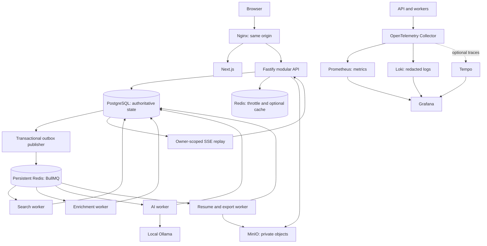
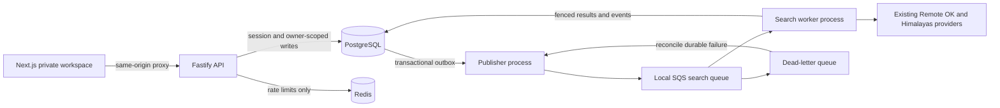

# v2 Docker-First Architecture And Migration Status

## Decision And Scope

The revised v2 target is a local, single-machine application with **no required
paid infrastructure or hosted inference services**. Docker Compose replaces the
AWS-oriented runtime target; BullMQ replaces SQS; MinIO replaces the LocalStack
object-store emulator; Ollama is the only supported inference provider in v2.
PostgreSQL, the modular Fastify core, Next.js, immutable matching inputs and the
transactional outbox remain. Kafka is not a v2 dependency.

This document is a specification, not a claim that the target stack is running.
The implementation inventory below remains authoritative for current behavior.
The existing compose.yml starts PostgreSQL, throttle Redis and LocalStack by
default. An opt-in bullmq profile now adds persistent queue Redis, and the publisher
and search worker accept QUEUE_TRANSPORT=bullmq with an explicit QUEUE_REDIS_URL.
SQS remains the default; no workload cutover has occurred. Other proposed services
must not be treated as implemented.

Zero required service fees does not mean zero total cost: hardware, electricity,
storage, connectivity and independent backups remain the owner's responsibility.
Docker Desktop eligibility and each dependency/model license must be checked for
the intended use. No free portal availability, public uptime, high availability,
unlimited inference or production readiness is promised. Sleeping or restarting
the host pauses service. Public hosting and AWS remain a separately approved v3.

## Target Topology



These processes share one modular core and database, not independently owned
microservice databases. Next.js never receives queue, object-root or database
credentials. The API validates and durably schedules work; it does not call an
LLM or execute browser automation in the request path. Redis notification loss
cannot erase business state. PostgreSQL events, not pub/sub, drive replay.

## Target Source Layout

Paths below are the intended homes, not a claim that all files exist. Keep the
current core cohesive; extract packages only when actual reuse warrants it.

```text
v2/
  apps/
   api/src/                    Authenticated routes, SSE, process bootstrap
   web/src/                    Private workspace; allowlisted public routes
   workers/
    search/src/               Collection and deterministic scoring (exists)
    enrichment/src/           Company enrichment, bounded external IO
    ai/src/                   Local ranking only; no submission capability
    files/src/                Resume parsing and exports
    email/src/                Approved Gmail ingestion
    application/src/          Separately enabled approval-gated browser work
  packages/core/src/
   schema.ts                   Drizzle schema and constraints (exists)
   database.ts                 Transactions and fencing (exists)
   profile.ts                  Versioned candidate inputs (exists)
   queue.ts                    SQS compatibility adapter (exists)
   bull-queue.ts               Opt-in BullMQ search adapter (exists)
   dispatch.ts                 Durable execution/recovery policy (exists)
   storage.ts                  Private object lifecycle (planned)
   inference.ts                Bounded Ollama protocol (implemented, not integrated)
   telemetry.ts                Redacted instrumentation (planned)
  migrations/                   Append-only generated SQL and metadata
  infra/
   Dockerfile                  Multi-stage API/worker and web targets
   nginx/                      Routing, TLS configuration and SSE behavior
   observability/              Collector, Prometheus, Grafana, Loki configs
  scripts/
   setup-local.mjs              Private configuration bootstrap (exists)
   setup-owner.ts              Interactive owner setup (exists)
   benchmark-llm.ts             Synthetic model quality/latency gate
   backup.ts                   Consistent DB/object backup manifest
   restore-check.ts            Isolated restore verification
   check-ui.ts                 Synthetic browser acceptance (exists)
  compose.yml                   Target core service manifest
  compose.observability.yml      Optional bounded observability profile
  compose.ollama.yml             Optional CPU/container inference profile
  ARCHITECTURE.md
```

Continue reusing root provider/shared/matching/resume packages through deliberate
build dependencies. Build images from the repository root so those packages are
available. Do not copy the v1 API, SQLite runtime, owner data, .env, browser state
or generated snapshots into an image. Use a restrictive Docker build context.

## Docker Compose Contract

This is the required manifest design; it is not a replacement executable Compose
file yet. Preserve the current database volume and development ports during the
transition. Every target image needs a reviewed version/digest, ARM64 support,
license/security review and actual startup tests before it is pinned.

| Service                   | Profile and exposure                                     | Persistence and startup requirements                                                           |
| ------------------------- | -------------------------------------------------------- | ---------------------------------------------------------------------------------------------- |
| nginx                     | Core; sole application host port, proposed loopback 5280 | Read-only config/cert mounts; web/API readiness; port replaces current preview only at cutover |
| web                       | Core; internal 3000                                      | Standalone Next build; no private build-time data                                              |
| api                       | Core; internal 5390                                      | Migration completed; PostgreSQL and throttle Redis ready                                       |
| migrate                   | One-shot; no ports                                       | Exclusive migration lock; fails closed; never auto-seeds owner                                 |
| postgres                  | Core; internal 5432                                      | Existing postgres-data volume; bounded connections and readiness                               |
| redis-queue               | Core; internal 6379                                      | Dedicated queue-data volume, AOF every second, noeviction                                      |
| redis-cache               | Core; internal 6379 in its own container                 | Disposable TTL-bound throttle/cache state, bounded eviction                                    |
| minio                     | Files; private service, console not public               | Persistent objects volume; private bucket initialization and least-privilege credentials       |
| publisher                 | Core; no ports                                           | PostgreSQL and queue ready; publishes/reconciles durable commands                              |
| search-worker             | Core; no ports                                           | PostgreSQL and queue; bounded public-provider egress                                           |
| enrichment-worker         | Enrichment opt-in; no ports                              | Queue/DB; provider quotas, timeouts and cancellation                                           |
| files-worker              | Files opt-in; no ports                                   | Queue/DB/MinIO; parser resource isolation                                                      |
| ai-worker                 | AI opt-in; no ports                                      | Queue/DB/local inference; concurrency one initially                                            |
| ollama                    | Container-inference opt-in; no public port               | Persistent model volume; explicit reviewed model pull                                          |
| email-worker              | Email opt-in; no ports                                   | Owner-approved OAuth; encrypted tokens; scoped external access                                 |
| application-worker        | Application opt-in; no public ports                      | Isolated browser identity and per-action approvals                                             |
| otel-collector            | Observability opt-in; internal receivers                 | Bounded memory/queues; never blocks business requests                                          |
| prometheus, loki, grafana | Observability opt-in; Grafana loopback only              | Bounded persistent retention; authenticated Grafana                                            |
| tempo                     | Trace opt-in                                             | Explicit trace storage/retention; not needed for metrics/logs                                  |

Use restart policies, health checks, explicit graceful stop periods, init for
child-process workers, log rotation, resource limits and a private service network.
API workers and web run non-root with dropped capabilities, read-only roots and
small writable tmpfs where supported. Data services get only their required
writable volumes. Never mount the Docker socket or share browser credentials.
Compose dependency ordering is not recovery: clients still need bounded reconnects.
Only workers needing external data get provider egress; do not declare an internal
network and accidentally disable their required DNS/HTTPS access.

Compose secret files are mounted files, not automatically encrypted secrets.
Use owner-only ignored files, supported *_FILE configuration, and narrowly scoped
service identities. Do not interpolate secrets into committed YAML or print
resolved Compose configuration in diagnostics. Separate DB migrator and runtime
roles. Encrypt OAuth tokens using a versioned key stored outside DB/backups.
Use host disk encryption plus encrypted backup archives for at-rest protection;
do not describe a plain MinIO or PostgreSQL volume as encrypted.

Nginx routes /api (including SSE) to Fastify and other requests to Next.js.
Set upload limits, finite proxy timeouts and trusted proxy handling. SSE uses
disabled response buffering, heartbeats and an idle timeout above heartbeat
interval; avoid compression buffering there. Loopback HTTP is the explicit local
development exception. LAN access requires separately approved TLS using a trusted
local certificate; never instruct users to bypass certificate warnings. Enable
Secure cookies on HTTPS, maintain exact-origin CSRF, and apply HSTS only on an
appropriate HTTPS hostname. TLS does not wait for AWS, but public exposure does.

## PostgreSQL Data Design

Use relational ownership and lifecycle columns, with validated JSONB for profile
snapshots, provider payload subsets and scoring evidence. Existing schema names
below match the current implementation; proposed additions need migrations/tests.

| Table or group                      | Required invariant and indexes                                                                                | State                                                         |
| ----------------------------------- | ------------------------------------------------------------------------------------------------------------- | ------------------------------------------------------------- |
| users, sessions                     | Unique user email; hashed opaque sessions with owner FK/expiry; add expiry cleanup index                      | Implemented; cleanup index pending                            |
| candidate_profiles                  | Owner primary key, positive revision, compare-and-swap saves                                                  | Implemented                                                   |
| search_runs                         | Owner/idempotency uniqueness, request hash, immutable matching inputs, valid lifecycle                        | Implemented                                                   |
| search_jobs                         | Unique run/fingerprint; owner/run index; validated normalized job and match evidence                          | Implemented                                                   |
| outbox_events                       | Command UUID, versioned ID-only payload, publication time; pending/recovery scan indexes                      | Implemented; scan indexes pending                             |
| command_executions                  | Outbox FK, durable attempts, renewable lease, monotonic fence; constrain allowed states                       | Implemented; additional constraints pending                   |
| run_events                          | Owner/run scope and durable sequence; add replay index and retention boundary                                 | Implemented; resumable ordering pending                       |
| resumes, resume_versions            | Owner FK, private object key/version, checksum, bytes, MIME, parser version, state; unique object key/version | Planned                                                       |
| ai_runs, match_results              | Command/input/profile/resume/model versions, validated result, latency, state; unique logical input/version   | Planned                                                       |
| companies, enrichment_runs          | Canonical company identity, source/time provenance, expiry; deduplicated refresh                              | Planned                                                       |
| saved_leads, lead_history           | Owner/job identity, preserved notes/statuses; revision-safe updates and transactional audit                   | Implemented for saved/archived; application lifecycle pending |
| email_connections, email_ingestions | Encrypted scoped tokens, owner/provider/message dedupe, acknowledged ingestion state                          | Planned                                                       |
| application_attempts, approvals     | Owner/lead/action identity, approval expiry and evidence, uncertain terminal outcome; duplicate guard         | Planned                                                       |
| export_runs, object_deletions       | Owner-scoped format/artifact lifecycle and durable cleanup commands                                           | Planned                                                       |

Use explicit transactions for state, outbox and terminal events. Enforce tenant
consistency with composite ownership constraints where related rows cross tables,
in addition to owner-scoped repositories. Do not rely on a JSONB owner field.
Migrations must specify backfill, validation and compatibility/rollback behavior;
never drop v1 data as part of a schema upgrade. Parameterize SQL and bound reads.

PostgreSQL full-text search is the initial search index: introduce a generated
tsvector and GIN index over permitted job fields when the query path needs it.
Use EXPLAIN and realistic synthetic volume before adding trigram or more indexes.
Store sortable score columns only when measured JSONB query cost warrants them.
Use keyset pagination for growing lead/event histories, not unbounded result sets.

## BullMQ And Durable Execution

BullMQ is a transport/scheduling mechanism; PostgreSQL remains the authority for
work and attempts. Preserve the existing ID-only, schema-versioned commands and
fenced commit contract while replacing the SQS-specific acknowledgement adapter.
Do not copy SQS receipt/visibility semantics literally into BullMQ.

1. API validates auth, quotas and input; one transaction writes the domain request,
   queued event and outbox command. Return 202 with run ID and status URL only
   after commit. PostgreSQL failure returns an error, never an invented queued run.
2. Publisher adds a BullMQ job using the command UUID as jobId, then records
   publication. Crash after add can duplicate publication. Retained job IDs help
   deduplication, but database idempotency must also survive removed Redis jobs.
3. Workers verify the durable command, acquire the database lease/fence, and renew
   it while BullMQ maintains its own lock. A lost lock, fence or cancellation
   aborts local work. Concurrency never substitutes for durable fencing.
4. Commit results and terminal events atomically only with the current live fence.
   Resolve the BullMQ processor after commit. Crash after commit is acknowledged
   on redelivery without repeating completed work.
5. Retry transient failures with bounded jitter and a single durable attempt
   budget (initially five). Coordinate BullMQ attempts/stall recovery with this
   budget so retries do not multiply. Validation/auth failures are permanent.
6. Exhausted or permanent failures create a durable failed/dead-letter state with
   safe error category and correlation ID. Retain BullMQ failed jobs for bounded
   inspection, but they are not the only failure record. Explicit replay creates
   a linked new command, not a reset of a terminal execution.
7. Reconcile published but nonterminal commands after Redis restart/loss. Active
   database leases suppress recovery duplicates; expired work is eligible again.
   Handle existing completed/failed BullMQ job IDs explicitly during repair.

Use distinct search.collect, company.enrich, job.rank, resume.parse,
email.process, export.generate and application.prepare queues. Each processor
supports only its command type. Start search/enrichment at one or two concurrent
tasks, parsing at one and AI at one; benchmark before increasing. Bound both job
age and admitted backlog. Return 429/503 when durable admission quotas are full;
accepted work may remain queued during Redis downtime and must be visible as such.

Queue Redis must use **noeviction**, dedicated memory headroom, AOF and a volume.
An AOF every-second policy can lose recent queue writes on a crash; outbox repair
closes that transport gap. Disk-full and OOM must alert/fail visibly. The existing
allkeys-lru Redis is unsafe for BullMQ and stays throttle-only until cutover.
Disposable cache eviction must never delete sessions, approvals or work state.

Cancellation is a persisted request checked before claim, during heartbeats and
before commit. Graceful shutdown stops taking jobs, aborts bounded operations and
releases/expires leases. Never treat a timed-out external submission as retry-safe:
uncertain application outcomes require human reconciliation, not automatic retry.

## MinIO And Resume Lifecycle

Use private S3-compatible buckets through an explicitly configured MinIO endpoint
and path-style addressing. Reuse the SDK, not LocalStack production assumptions.
Pin a reviewed maintained build and assess MinIO's AGPL/distribution obligations;
do not assume a supported free binary or use an unreviewed latest image. Failure
to identify a suitable build/license is an implementation blocker, not permission
to silently substitute a paid service.

The API authorizes uploads, bounds bytes and issues a short-lived scoped upload
grant. Files begin quarantined under a server-generated owner/object key; a
completion request rechecks object metadata, size and checksum and records an
immutable object version. Parsing then runs outside HTTP with file signature/MIME
validation, allowed formats, page/archive expansion limits, timeout and memory
limits. Never execute macros or fetch embedded links. Parsing failure must not
replace the last usable resume/profile. Derivations retain source/version evidence.

For direct browser uploads the signing endpoint must be reachable through the
same-origin object gateway and preserve the signed host/path; internal minio DNS
URLs are not browser URLs. Otherwise use a bounded streaming API upload. Restrict
CORS to the configured origin. Downloads require ownership checks and short-lived
grants; redact presigned URL queries from logs. No bucket listing/public policy.

Object creation and SQL are not one transaction: use pending/ready/failed/deleting
states, expiry for abandoned uploads, idempotent reconciliation and durable delete
commands. Versioning improves recovery but is not backup. Set explicit retention
for originals, derivatives, exports and old versions; never delete an object still
referenced by a retained job or resume version. Test orphan cleanup on synthetic data.

## Local Inference Strategy

**Local LLM: Ollama. Qwen3.5 9B is the preferred model, with Qwen3.5 4B as the
resource-constrained fallback. Model selection must remain configurable and
benchmark-driven. Larger models are explicitly excluded from the baseline 16 GB
deployment.** This preference is not a production-default or performance claim:
benchmark both models with the application running before activating either.

Use `qwen3.5:9b` (approximately 6.6 GB download) for normal workloads when it passes
the acceptance gates; use `qwen3.5:4b` (approximately 3.4 GB download) when the 9B
model causes memory pressure, excessive latency or unacceptable contention with
application services. Download size is not total runtime memory. The 27B, 35B and
122B variants are excluded from this machine's baseline, not future larger hosts.
If neither candidate passes, retain deterministic functionality with AI disabled.

No model is hard-coded or silently downloaded. AI stays disabled until a reviewed
installed model is explicitly selected. The benchmark parser now accepts
LLM_PROVIDER, OLLAMA_BASE_URL, OLLAMA_MODEL and LLM_TIMEOUT_MS. Automatic fallback
and worker configuration below remain **proposed**, not wired into API/search:

```dotenv
LLM_PROVIDER=ollama
OLLAMA_BASE_URL=http://ollama:11434
OLLAMA_MODEL=qwen3.5:9b
OLLAMA_FALLBACK_MODEL=qwen3.5:4b
LLM_MAX_CONCURRENCY=1
LLM_TIMEOUT_MS=300000
LLM_CONTEXT_WINDOW=4096
```

Validate keys at startup, reject nonlocal providers, bound timeouts/concurrency,
and cap input bytes, context tokens, output tokens and response bytes. Container
DNS endpoints need an explicit allowlist; current loopback-only endpoint validators
will require targeted changes/tests, not removal of SSRF protection. Secrets are
not needed for a private Ollama endpoint; it still must not be publicly reachable.

On this 16GB Apple Silicon Mac, prefer native Ollama with Metal for interactive
inference and Docker Compose for the rest. Docker Desktop Linux containers do not
normally expose the Mac Metal GPU; the all-container option must be benchmarked
as CPU inference and may be much slower. Configure a tested, narrowly reachable
host endpoint for the AI worker, with firewall restrictions; do not expose Ollama
on every network interface merely to make container access work. Linux GPU hosts
can use a separately tested GPU Compose configuration later.

Start with 4,096 context tokens; test 8,192 only with measured headroom. The model's
advertised maximum context does not justify a 131K/256K runtime allocation here.
The proposed AI router selects only among configured, installed, benchmark-approved
models. Route subsequent work to 4B on sustained measured pressure or latency
degradation, with a cooldown to prevent repeated switching. Finish or cancel the
current request and unload its model before loading the fallback; cap Ollama at
one loaded model and one active request, not just application concurrency one.
Container memory metrics alone do not measure native Ollama or whole-host pressure.
Automatic pressure-based routing and its thresholds are not implemented yet;
manual configuration remains the initial selection mechanism. Never retry model
inference by duplicating application submissions or other external side effects.

Benchmark 4B and 9B against the same synthetic fixtures, both alone and with the
expected PostgreSQL, Redis, file-storage, API, worker and browser workload active.
Record exact model digest/license, quantization, context, prompt/schema version,
cold/warm p50/p95 latency, tokens/sec, CPU usage, peak resident memory/swap, timeout
rate, structured JSON validity and evidence-grounded output quality. Measure
concurrent application latency and failures, not just isolated model throughput.
Target reliable 10-30 second responses for routine bounded tasks; this is a UX
target to measure, not a promised capability. Include negative
cases, snippets, missing qualifications, prompt injection, outage and cancellation.
A larger parameter count alone is not a quality result. The previously tested
1.5B model is historical evidence only, not the v2 baseline. Do not delete existing
model volumes incidentally.

Provisional gate: every mandatory safety/schema fixture passes, warm p95 for the
bounded ranking unit is under 120 seconds, worst-case work respects the 300-second
deadline, and the combined workload causes no sustained swap pressure. Declare the
unit (one job or a bounded batch) in each benchmark. Revise latency/quality targets
explicitly if none passes; keep deterministic ranking enabled instead of claiming
a best model without measurements. Model downloads consume disk/network and need
current authorization before large pulls or replacing a configured model.

AI ranks only a bounded deterministic shortlist, with minimal profile facts and
untrusted description text clearly separated. It cannot call tools, browse, create
skills, weaken hard exclusions/confidence ceilings or approve applications. Validate
the exact result IDs, scores and evidence before storing. Cache/reuse keys include
input hash, profile/resume revision, prompt/schema version and model digest; never
apply results to a newer input. Preserve deterministic scores when the model is
missing, overloaded, malformed or unavailable; expose queued/running/failed AI
state separately from successful search completion.

The planned model roles also include resume/job-description analysis, matching
explanations, skill-gap analysis, summaries, cover-letter drafts, structured
extraction and AI-assisted recommendations. Each needs task-specific quality and
JSON checks where applicable; a ranking benchmark does not validate every role.
Drafts must use verified candidate facts and require user review. These workflows
remain planned capabilities, not implemented merely by naming a preferred model.

## SSE, Caching And Public Data

Persist owner-scoped progress/terminal events in the same transaction as state.
SSE authenticates the session, validates run ownership and resumes from a bounded
Last-Event-ID. Recheck session validity, limit concurrent streams, send heartbeats,
and handle disconnect/backpressure. UI reconnects with bounded backoff and falls
back to status reads; it never needs browser-stored private tokens.

The current bigserial sequence alone is not a commit-order guarantee: concurrent
transactions can commit out of allocation order. Before enabling replay, serialize
per-run event allocation with a run-row lock/transactional counter, and index
(owner_id, run_id, sequence). Test overlapping commits and replay gaps. Return an
explicit reset/snapshot response when a cursor predates retention; do not silently
skip events. Transport notifications can wake readers but are never authoritative.

Begin with SQL reads and no result cache. Add bounded owner/version-keyed Redis
caches only for measured repeated queries, with TTL, invalidation after commit
and cache-miss fallback. Redis remains authoritative for neither auth nor status.
Private Next.js/API responses remain no-store; do not cache session-dependent pages
in shared rendering caches. Public jobs use a separate field/URL allowlist, canonical
public IDs, SEO and explicit publish/withdraw invalidation. No private profile,
resume, note or application metadata may cross that boundary. Existing Pages and
encrypted admin remain unchanged until their migration is explicitly verified.

## Security And Observability

Preserve Argon2id, opaque hashed sessions, owner scope, origin/CSRF enforcement,
rate limits and strict input schemas. Fail closed when authorization dependencies
are unavailable. Treat portal/email/resume/model text as untrusted. Keep outbound
HTTPS, redirect/DNS/private-address controls and separate public-provider versus
explicit local-service clients. Audit approval/status transitions without logging
credentials, full resumes, mailbox text or presigned links. AI and search workers
must not possess application-submission credentials. Apply CSP nonce hardening
before broader exposure; never weaken existing isolation for portal compatibility.

OTel instruments API, outbox, workers and inference with correlation metadata,
not private payloads. Metrics and logs are separate signals: Prometheus scrapes
collector metrics; Loki stores redacted logs; Grafana queries both. Persisting
traces needs Tempo or another explicit backend, not Prometheus. Redact before
export, bound cardinality and avoid owner/job IDs as metric labels. Telemetry
export failure drops/queues bounded telemetry without blocking user requests.

Dashboards cover API error/latency, queued age, outbox lag, retries/stalls, dead
letters, lease failures, model latency/invalid outputs, DB pool pressure, Redis
memory/evictions, object failures, disk capacity and backup age. Use liveness for
process health and readiness for required dependencies; optional AI/telemetry
outage does not make deterministic search unavailable. Configure local alerts and
test the notification route; an alert confined to a powered-off laptop cannot
provide independent outage detection.

On the current laptop, start with core services and redacted structured logs.
Observability and application-browser profiles are opt-in until combined resource
tests pass. Initial planning budgets are 3-4GiB for core containers and another
1-2GiB for bounded telemetry, excluding inference and the host OS/editor/browser.
These are provisional measurements to validate, not guaranteed capacity. Start
metrics at 7 days, logs at 3 days and traces at 1 day with byte caps and rotation;
adjust to measured disk usage. Do not run every profile and the existing v1 stack
simultaneously without checking memory. No hardware upgrades are assumed.

## Migration And Acceptance Plan

1. Implement/test BullMQ adapter and separate queue Redis without changing the
   active SQS path. Run contract tests for duplicate delivery, crash before/after
   commit, stalled jobs, attempt exhaustion, cancellation and Redis data loss.
2. Quiesce new submissions at an explicit cutover, stop old consumers/publisher,
   reconcile outstanding database commands and enable one queue transport. Never
   process a command through both transports casually. Back up and prove rollback
   first; preserve LocalStack until outstanding work is accounted for.
3. Add MinIO upload/parser/export lifecycle and isolated restore tests, then AI
   queue/Ollama with benchmark evidence and durable SSE. Continue multi-source,
   enrichment, Gmail, lead/history and approval-gated application migration.
4. Build reproducible non-root images, introduce Nginx and test the actual Compose
   target on ARM64. Preserve v1 ports/data; switch preview port only deliberately.
   Implement telemetry profiles after measuring core resource use.
5. Before copying owner data, take a verified v1 snapshot with a manifest. Dry-run
   SQLite-to-PostgreSQL migration on an isolated copy; compare counts, identities,
   statuses, notes, object checksums and duplicates. Authorize the real cutover
   separately; retain read-only rollback data. No silent status changes.
6. Back up PostgreSQL using a consistent dump plus referenced immutable object
   versions and a manifest. Coordinate retention so referenced objects cannot be
   deleted during backup. Encrypt archives, protect keys separately and keep an
   independent copy. Restore into new volumes and verify authentication, objects,
   queue reconstruction and application history. A same-disk copy is not disaster
   recovery. Provisional daily backups imply up to 24h data loss; measure restore
   time and agree actual RPO/RTO before calling the deployment operationally ready.
7. Run type/lint/test/build/format gates, synthetic database/queue/storage tests,
   three-engine responsive UI checks and real container restart/backup/restore
   acceptance. Test all required dependency outages, disk pressure, host restart,
   model cancellation and an agreed multi-hour mixed-workload soak. Record skipped
   live-provider, mailbox and application actions instead of simulating success.
8. Only after migration/acceptance, refresh root context.txt and related runbooks,
   remove proven-unused code/dependencies/emulators and rerun post-cleanup gates.
   Preserve active v1, secrets, owner data, backups and reusable domain packages.

This plan supersedes the SQS/S3-emulator target, not the already verified behavior.
No dependency replacement, model pull, runtime reconfiguration, data migration or
service shutdown is performed merely by accepting this specification.

## Current Implemented Data Flow



The browser currently polls persisted run status; resumable SSE is still pending.
Only `search.collect` has an active route and handler. The other command names
are reference-only contracts, not implemented workers.

## Ownership And Trust

- PostgreSQL owns users, sessions, search requests, idempotency keys, results,
  command attempts, leases and outcomes. Redis never authorizes an action.
- Candidate profiles are owner scoped and revision checked. Each search stores
  only the location, preferences and application facts needed for matching, not
  contact details. Idempotent replay retains the original snapshot after edits.
  Scoring uses that snapshot and the run creation time; a missing profile produces
  unscored results. Resume-derived facts and optional AI ranking remain pending.
- Private HTTP reads and writes are owner scoped. Session cookies are HttpOnly,
  SameSite=Strict, eight-hour absolute lifetime, and Secure when configured for
  HTTPS. Local development uses HTTP. Login rotates the presented session;
  logout deletes its durable record. Owner creation is terminal-only and locked.
- Mutations require the configured origin. Authenticated mutations also require
  a session-derived CSRF token. Cross-origin API access is not enabled.
- Commands contain IDs and correlation metadata, never resume/email contents.
  Consumers compare the complete message with the durable outbox record before
  execution. Unknown commands cannot acquire a database lease.
- Provider content is untrusted. Collection reuses bounded HTTP and normalization;
  persisted job links require HTTPS without credentials. UI descriptions render
  as text. There is no application-submission capability in this slice.
- API logs omit credentials and request bodies. Generic failures retain request
  IDs. Operational metrics, distributed traces and a diagnostics dashboard are
  not yet wired. Next.js CSP still permits inline scripts; nonce-based hardening
  is required before broader hosting.

## Delivery And Failure Semantics

1. Creating a search, its queued event and its outbox command is one transaction.
   A unique `(owner_id, idempotency_key)` makes concurrent identical requests
   return one run. Different inputs with the same key return 409.
2. Publisher sends before marking publication. A crash in between may duplicate
   delivery, which is expected. This is at-least-once, never exactly-once delivery.
3. PostgreSQL leases last 60 seconds. Workers renew every 15 seconds and extend SQS
   visibility. A new attempt increments the fence; stale workers cannot commit.
4. Result insertion, terminal run state, execution state and event insertion share
   one transaction. Failed provider work cannot write a completed search.
5. Retry failures use bounded jitter; attempts are durable, not Redis counters.
   Exhausted work transitions to failed. DLQ reconciliation marks abandoned runs
   failed only after acquiring a lease. Completed/failed records are not revived.
   DLQ messages are retained for inspection and expire under the queue policy.
6. Published commands older than two minutes become eligible for republication
   only if no live or terminal execution exists. This also recovers disposable
   local queue loss. Concurrent publishers can duplicate messages; fencing remains
   the authority. A managed queue migration must preserve this contract.

No v1 data is copied automatically. Schema changes use checked-in generated SQL.
There is no verified SQLite-to-PostgreSQL migration or PostgreSQL restore procedure
yet. Do not remove the PostgreSQL volume or use production data for tests.

## Remaining v2 Work

| Area                                                           | Status                                                                                                                   |
| -------------------------------------------------------------- | ------------------------------------------------------------------------------------------------------------------------ |
| Private search UI/API and real search handler                  | Implemented; synthetic browser/provider and service tests                                                                |
| Public Next.js jobs/SEO and public cache invalidation          | Not migrated; existing Pages remains unchanged                                                                           |
| Profiles and preferences                                       | Implemented with revision conflicts and immutable search inputs                                                          |
| Resume metadata and resume-derived matching facts              | Not migrated                                                                                                             |
| MinIO upload/download, validation, retention and resume worker | Revised target; SDK installed, MinIO/workflows not implemented                                                           |
| BullMQ transport and persistent queue Redis                    | Opt-in adapter tested including isolated restart/AOF restore and process lifecycle; cutover/soak pending                 |
| Deterministic matching                                         | Connected with exclusions, confidence guards and UI evidence                                                             |
| Isolated optional AI rank worker                               | Existing v1 implementation remains; v2 not connected                                                                     |
| Company enrichment and multi-source collection                 | Remote OK + Himalayas selection/deduplication implemented; other sources, partial outcomes and enrichment pending        |
| Gmail ingestion and email worker                               | Not migrated                                                                                                             |
| Saved leads, application history and exports                   | Saved leads/notes/archive/restore/audit and search JSON export implemented; application history and bulk exports pending |
| Approval-gated isolated browser/application worker             | Not implemented; no automatic submissions                                                                                |
| Resumable SSE, cancellation and detailed progress              | Owner-scoped cancellation and fenced terminal events implemented/tested; UI polling remains; resumable SSE pending       |
| OTel metrics/traces and operational dashboards                 | Dependencies installed; configuration/instrumentation pending                                                            |
| Data migration, backup/restore and load/soak acceptance        | Not verified                                                                                                             |

The complete architecture request is therefore **still in progress**. A working
search slice is not feature parity and must not be presented as v2 complete.

## v3 Boundary

AWS provisioning, EC2/ECS topology, managed endpoints, IAM, Terraform, cloud
deployment CI, scaling, cost acceptance and cloud rollback belong to v3 under the
user's requested split. Local Compose packaging and local TLS are v2 work.
No cloud resources were created.
Kafka remains deferred until a demonstrated requirement justifies it. SSR requires
a Next.js runtime; S3 alone cannot host the private dynamic application. Inference
capacity must be planned separately; Fargate does not provide GPU inference.

Docker packaging is portable, not proof of a configuration-only cloud migration.
ECS can run these process images; BullMQ can remain backed by a compatible managed
Redis service, or a later SQS adapter must satisfy the same durable execution
tests. S3-compatible storage eases object migration but still needs identity,
version/URL and retention acceptance. Cloud TLS, IAM, secrets, networking, restore,
GPU capacity and cost all require fresh design/verification. Kubernetes is not a
default next step and neither it nor Kafka is needed for this single-machine target.
